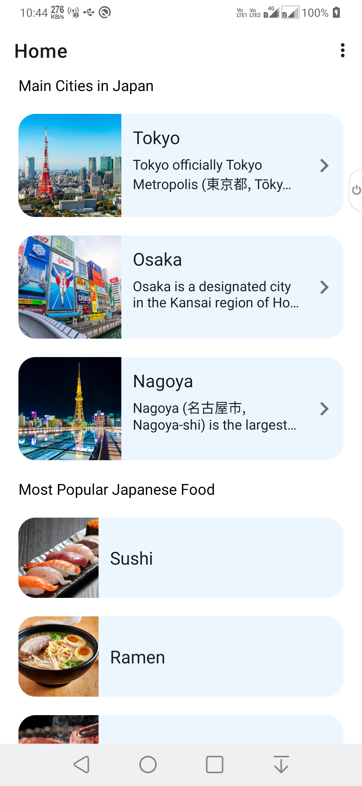
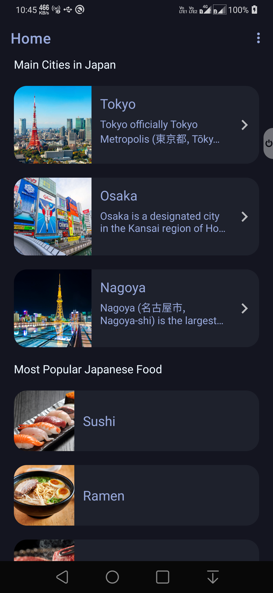
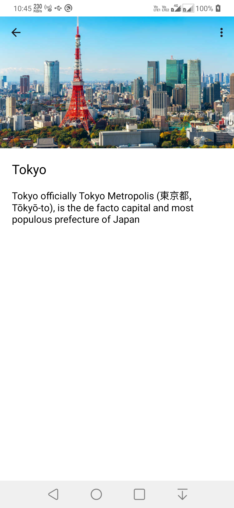

# JaPark

-------------------------------------------------
JaPark – Features
-------------------------------------------------

* Splash Screen : Lifecycle aware splash screen
* Home Screen : Lists of cities and foods, options in menu to change theme and clear persisted data (of cities and foods from RoomDB)
* City Details Screen : A scrollable screen with collapsing toolbar to show city details and options in menu to change theme
* Food Detail Popup : A popup screen for food image and name

-------------------------------------------------
JaPark – Project Structure
-------------------------------------------------

* constants :- contains constant values in kotlin objects
* data :- persisted data storage by using RoomDB and SharedPreferences
* di :- contains dagger modules according to their respective scopes
* models :- contains model/POJO classes and other base and sealed classes
* network :- network/api calls client and constants
* uiModules :- contains UI modules by functionality with ViewModel and Repositories
* utils : contains the util classes, extension functions, delegates, and DataBinding adapters

